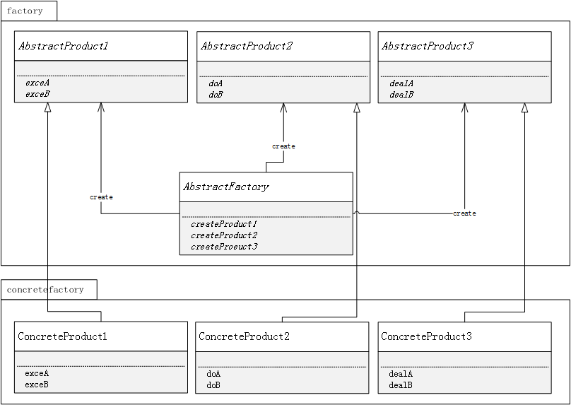

 抽象工厂模式中，抽象工厂的工作就是将“抽象零件”组装为“抽象产品”，也就是说，我们并不关心零件的具体实现，而是只关心接口。我们仅使用该接口将两件组装成为产品

下面是抽象工厂模式总的代码示例：

抽象的零件：Item类：

```java
package com.ateacer.study.designpattern.abstractfactory;

public abstract class Item {

    protected String caption;

    public Item(String caption) {
        this.caption = caption;
    }

    public abstract String makeHtml();
}
```

抽象的零件：Link类：Link类表示url的地址

```java
package com.ateacer.study.designpattern.abstractfactory;

public abstract class Link extends Item {

    protected String url;

    public Link(String caption, String url) {
        super(caption);
        this.url = url;
    }
}
```

抽象的零件：Tray类：Tray类表示的是一个含有多个Link类和Tray类的容器

```java
package com.ateacer.study.designpattern.abstoryfactory;

import java.util.ArrayList;

public abstract class Tray extends Item {

    protected ArrayList<Item> tray = new ArrayList<Item>();

    public Tray(String caption) {
        super(caption);
    }

    public void add(Item item) {
        tray.add(item);
    }
}
```

抽象的产品：Page类

```java
package com.ateacer.study.designpattern.abstractfactory;

import java.io.FileWriter;
import java.io.IOException;
import java.io.Writer;
import java.util.ArrayList;

public abstract class Page {

    protected String title;

    protected String author;

    protected ArrayList<Item> content = new ArrayList();

    public Page(String title, String author) {
        this.title = title;
        this.author = author;
    }

    public void add(Item item) {
        content.add(item);
    }

    public void output() {

        Writer writer = null;
        try {
            String fileName = title + ".html";
            writer = new FileWriter(fileName);

            System.out.println(fileName + "编写完成");
        } catch (IOException e) {
            e.printStackTrace();
        } finally {
            if (writer != null) {
                try {
                    writer.close();
                } catch (IOException e) {
                    e.printStackTrace();
                }
            }
        }
    }
}
```

抽象的工厂：Factory类，可以根据其中的`getFactory`方法根据指定的类名生成一个具体的工厂实例

```java
package com.ateacer.study.designpattern.abstractfactory;

public abstract class Factory {

    public static Factory getFactory(String classname) {
        Factory factory = null;

        try {
            factory = (Factory) Class.forName(classname).newInstance();
        } catch (ClassNotFoundException e) {
            e.printStackTrace();
        } catch (IllegalAccessException e) {
            e.printStackTrace();
        } catch (InstantiationException e) {
            e.printStackTrace();
        }

        return factory;
    }

    /**
     * @param caption
     * @param url
     * @return
     */
    public abstract Link createLink(String caption, String url);

    /**
     * @param caption
     * @return
     */
    public abstract Tray createTray(String caption);

    /**
     * @param title
     * @param author
     * @return
     */
    public abstract Page createPage(String title, String author);
}
```

具体的工厂：ListFactory类

```java
package com.ateacer.study.designpattern.abstractfactory;

public class ListFactory extends Factory {
    public Link createLink(String caption, String url) {
        return new ListLink(caption, url);
    }

    public Tray createTray(String caption) {
        return new ListTray(caption);
    }

    public Page createPage(String title, String author) {
        return new ListPage(title, author);
    }
}
```

具体的零件：ListLink类

```java
package com.ateacer.study.designpattern.abstractfactory;

public class ListLink extends Link {

    public ListLink(String caption, String url) {
        super(caption, url);
    }

    public String makeHtml() {
        return "    <li><a href=\"" + url + "\">" + caption + "</a></li>\n";
    }
}
```

具体的零件：ListTray类

```java
package com.ateacer.study.designpattern.abstoryfactory;

import java.util.Iterator;

public class ListTray extends Tray {

    public ListTray(String caption) {
        super(caption);
    }

    public String makeHtml() {
        StringBuffer buffer = new StringBuffer();

        buffer.append("<li>\n");
        buffer.append(caption + "\n");
        buffer.append("<url>\n");

        Iterator iterator = tray.iterator();
        while (iterator.hasNext()) {
            Item item = (Item) iterator.next();
            buffer.append(item.makeHtml());
        }

        buffer.append("</url>\n");
        buffer.append("</li>\n");

        return buffer.toString();
    }
}
```

具体的产品：ListPage类

```java
package com.ateacer.study.designpattern.abstoryfactory;

import java.util.Iterator;

public class ListPage extends Page {
    public ListPage(String title, String author) {
        super(title, author);
    }

    public String makeHtml() {
        StringBuffer buffer = new StringBuffer();

        buffer.append("<html><head><title>" + title + "</title></head>");
        buffer.append("<body>\n");
        buffer.append("<h1>" + title + "</h1>\n");


        Iterator iterator = content.iterator();
        while (iterator.hasNext()) {
            Item item = (Item) iterator.next();
            buffer.append(item.makeHtml());
        }

        buffer.append("</url>\n");
        buffer.append("<hr><address>" + author + "</address>\n");

        return buffer.toString();
    }
}
```

根据以上代码示例绘出如下类图结构：



**AbstractFactory模式中的相关角色如下：**

- **AbstractProduct（抽象产品）**

  AbstractProduct角色负责定义AbstractFactory角色所生成的抽象零件和产品的接口

- **AbstractFactory（抽象工厂）**

  AbstractFactory角色负责定义用于生成抽象产品的接口

- **Client（委托者）**

  Client角色仅会调用AbstractFactory角色和AbstractProduct橘色的接口来进行工作，对于具体的零件、产品和工厂一无所知

- **ConcreteProduct（具体的产品）**

  ConcreteProduct角色负责实现AbstractProduct角色的接口

- **ConcreteFactory（具体工厂）**

  ConcreteFactory角色负责实现AbstractFactory角色的接口

**AbstractFactory模式的特点：**

- 易于增加具体的工厂
- 难以增加新的零件

**java中生成一个对象实例的方法：**

- 使用new生成一个新的对象（强耦合）
- 可以利用Prototype模式
- 利用newInstance生成
