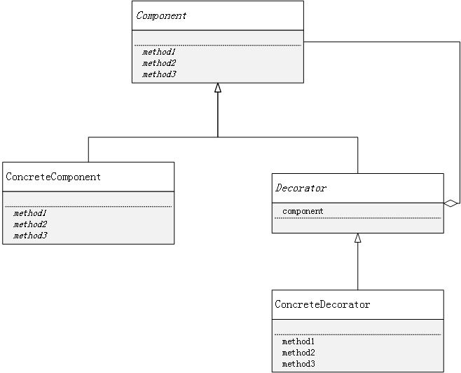

装饰者模式就是不断地给对象添加装饰的模式

# 一、装饰者模式的示例代码如下：

## 1、Display

Display是可以显示多行字符串的抽象类，其使用了`getColumns()`、`getRows()`，`getRowText(int rows)`等抽象方法，属于模板方法模式,其代码如下：

```java
package com.ateacer.study.designpattern.decorator;

public abstract class Display {

    public abstract int getColumns();

    public abstract int getRows();

    public abstract String getRowText(int rows);

    public final void display() {
        for (int i = 0; i < getRows(); i++) {
            System.out.println(getRowText(i));
        }
    }
}
```

## 2、StringDisplay

StringDisplay是Display的实现，所有的装饰都是围绕着它来进行的，其代码示例如下：

```java
package com.ateacer.study.designpattern.decorator;

public class StringDisplay extends Display {

    private String string;

    public StringDisplay(String string) {
        this.string = string;
    }

    public int getColumns() {
        return string.length();
    }

    public int getRows() {
        return 1;
    }

    public String getRowText(int rows) {

        if (rows == 0) {
            return string;
        }
        return null;
    }
}
```

## 3、Border

Border是装饰类，它是所有装饰方式的抽象，它继承了Display类，通过继承，装饰边框与装饰物具有了相同的方法。从接口角度来讲，装饰边框与装饰物具有相同的方法也就意味着他们具有一致性，其示例代码如下：

```java
package com.ateacer.study.designpattern.decorator;

public abstract class Border extends Display {

    /**
     * 被装饰物
     */
    protected Display display;

    public Border(Display display) {
        this.display = display;
    }
}
```

## 4、SideBorder

SideBorder是Border的一种实现，它是一种具体的装饰边框，示例代码如下：

```java
package com.ateacer.study.designpattern.decorator;

public class SideBorder extends Border {

    private char ch;

    public SideBorder(Display display, char ch) {
        super(display);
        this.ch = ch;
    }

    public int getColumns() {
        return display.getColumns() + 2;
    }

    public int getRows() {
        return display.getRows();
    }

    public String getRowText(int rows) {
        return ch + display.getRowText(rows) + ch;
    }
}
```

## 5、FullBorder

FullBorder也是Border的一种实现，它也是一种具体的装饰边框，示例代码如下：

```java
package com.ateacer.study.designpattern.decorator;

public class FullBorder extends Border {

    public FullBorder(Display display) {
        super(display);
    }

    public int getColumns() {
        return display.getColumns() + 2;
    }

    public int getRows() {
        return display.getRows() + 2;
    }

    public String getRowText(int rows) {

        if (rows == 0 || rows == display.getRows() + 1) {
            return "+" + makeLine('-', display.getColumns()) + "+";
        } else {
            return "|" + display.getRowText(rows - 1) + "|";
        }
    }

    private String makeLine(char ch, int count) {
        StringBuffer buffer = new StringBuffer();
        for (int i = 0; i < count; i++) {
            buffer.append(ch);
        }

        return buffer.toString();
    }
}
```

编写如下测试类:

```java
import com.ateacer.study.designpattern.decorator.Display;
import com.ateacer.study.designpattern.decorator.FullBorder;
import com.ateacer.study.designpattern.decorator.SideBorder;
import com.ateacer.study.designpattern.decorator.StringDisplay;

public class DecoratorTest {

    public static void main(String[] args) {
        Display b1 = new StringDisplay("Hello,world.");
        Display b2 = new SideBorder(b1, '#');
        Display b3 = new FullBorder(b1);
        b1.display();
        b2.display();
        b3.display();
    }
}
```

其运行结果如下:

```
Hello,world.
#Hello,world.#
+------------+
|Hello,world.|
+------------+
```

# 二、Decorator模式中相关角色

## 1、Component

增加功能时的核心角色， 示例程序中Display类扮演此角色

## 2、ConcreteComponent

该角色实现了Component角色锁定义的接口，在示例程序中由StringDisplay扮演此角色

## 3、Decorator（装饰物）

 该角色具有与Component角色相同的接口。在它内部保存了被装饰对象-Component角色，Decorator角色知道自己要装饰的对象

## 4、ConcreteDecorator

该角色是具体的Decorator角色。在程序中，SideBorder和FullBorder扮演此角色

**装饰者模式的类图结构如下:**




# 三、Decorator模式的优缺点

## 1、优点

a、接口透明，不会因为增加了功能而改变原有接口

b、在不改变被装饰物前提下增加功能

c、可以动态地增加功能

d、只需要一些装饰物就可以添加很多功能

## 2、缺点

会导致增加许多很小的类
