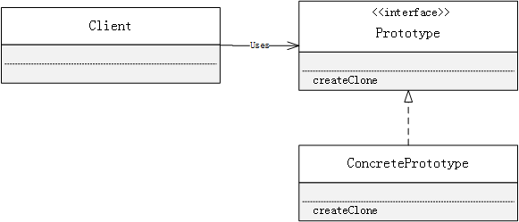

**什么是Prototype模式？**

不根据类来生成实例，而是根据实例来生成实例的模式，是Prototype模式

下边是Prototype模式的示例代码：

Client：

```java
package com.ateacer.study.designpattern.prototype;

import java.util.HashMap;

public class Manager {

    private static HashMap<String,Prototype> protos = new HashMap<String, Prototype>();

    public void register(String name,Prototype prototype){
        protos.put(name,prototype);
    }

    public Prototype create(String name){
        Prototype prototype = protos.get(name);
        return prototype.createClone();
    }
}
```

Prototype：

```java
package com.ateacer.study.designpattern.prototype;

public interface Prototype extends Cloneable {

    void use(String s);

    Prototype createClone();

}
```

ConcretePrototype：

```java
package com.ateacer.study.designpattern.prototype;

public class ConcretePrototype implements Prototype {

    private char decChar;

    public ConcretePrototype(char decChar) {
        this.decChar = decChar;
    }

    public Prototype createClone() {

        try {
            Prototype prototype = (Prototype) clone();
            return prototype;
        } catch (CloneNotSupportedException e) {
            e.printStackTrace();
        }
        return null;
    }

    public void use(String s) {

        int len = s.getBytes().length;

        loop(len, decChar);

        System.out.println(decChar + " " + s + " " + decChar);

        loop(len, decChar);
    }

    public void loop(int loop, char decChar) {
        for (int i = 0; i < loop + 4; i++) {
            System.out.print(decChar);
        }

        System.out.println("");
    }
}
```

**Prototype模式中的相关角色**

- **Prototype（原型）**

  Prototype角色用于负责定义用于复制现有实例来生成新实例的方法。

- **ConcretePrototype（原型实现）**

  ConcretePrototype角色负责实现复制现有实例并生成新实例的方法

- **Client（使用者）**

  Client角色负责使用复制实例的方法生成新的实例

**Prototype模式的类关系图如下：**


