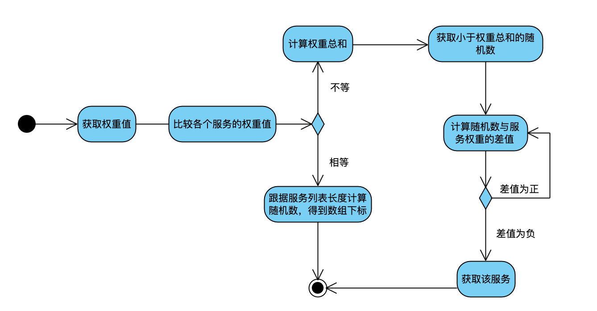

Dubbo采用软负载均衡的方式，来处理服务的分发，负载均衡也是采用插件的形式实现，Dubbo中默认的负载均衡实现方式有四种，分别是随机、轮询、最小活跃数、一致性哈希。默认采用随机负载均衡方式，如果以上四种方式不满足需求，用户也可以自己实现。

Dubbo中负载均衡的类图结构如下：

目前最新版本（2.7.x）中的`MockLoadBalance`还没有具体实现，我们主要关注`AbstractLoanBalance`以及其实现类就可以

**问题：** 如果对于`FailoverClusterInvoker`，在第一次失败后，重新选择第二个可调用服务，在负载均衡中计算权重的时候，如果因为临时修改权重导致负载均衡又选择了第一次调用失败的服务，这个时候怎么办？

**答：** 在`FailoverClusterInvoker`中，如果第一次调用失败，在选择第二个可调用服务的时候，如果因为服务全中值发生变化导致又选择到第一个调用失败的服务，这个时候会触发reselect，即重新选择，其逻辑是：选择该服务所在列表索引的下一个位置的服务进行调用。实际上触发`FailoverClusterInvoker`重新选择的不止这一个因素，譬如可调用服务列表发生变化，也会进行重新选择

## 1、随机负载均衡：

Dubbo中的随机负载均衡，实际上应该叫加权随机负载均衡，Dubbo给每个可调用的服务添加了一个负载因子，通过负载因此来调整每个可调用服务的随机权重，默认情况下，每个可调用服务的权重为100，用户也可以在Dubbo控制台调整权重值

其处理逻辑如下图所示：

**描述：**

a、遍历服务列表

b、获取每个服务的权重值

c、对比每个服务的权重值，若权重值相等，则取服务总数的随机数，获取到的随机数就是最终获取到的服务在列表中的索引，若权重值不相等，则跳到步骤d

d、计算所有服务权重值的总和

e、再次遍历服务列表

f、取得d步骤计算出来的总权重值的随机数

g、计算每个服务的权重值与f计算得到的随机数的差值

h、若g计算的差值为负，则该服务就是要取得的服务，否则，回退到g步骤，直到差值为负

i、返回取得服务

## 2、轮询负载均衡

Dubbo中的轮询负载均衡策略，实际上也是加权轮询负载均衡，Dubbo根据每个服务的权重值来控制轮询的先后顺序,如果所有服务的权重值都相等，则取第一个被遍历的值